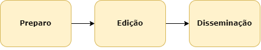

A linha de produção do Carta Ortoimagem é composta das seguintes fases.

## Pré-definições

A definição da ortoimagem e MDT do projeto deve ser baseada na escala e nos parâmetros de qualidade do projeto, principalmente quanto a acurácia posicional.

Tal acurácia, relativa aos produtos finais (CDGV Ortoimagem e Carta Ortoimagem) será definida indiretamente, de acordo com a acurácia posicional dos insumos e garantindo que os erros inseridos durante o processo de produção não mudem o PEC do produto final. Nas informações marginais do produto deve estar claramente indicado a derivação, por exemplo *"PEC Planimétrico: A (derivado da ortoimagem")*.

## Preparo

A fase de Preparo tem por finalidade criar um banco contíguo de edição a partir dos dados vetoriais contínuos do banco de extração. Possui apenas uma subfase denominada Preparo para Edição.

## Edição

A fase de Edição tem por finalidade aplicar generalização cartográfica compatível com a escala de uso do produto impresso. Possui apenas uma subfase, também denominada Edição, onde é utilizada todas as classes previstas na EDGV 3.0 Orto, incluindo as classes auxiliares de edição.

## Disseminação

A fase de Disseminação consiste na geração dos metadados, geração do .pdf e .geotiff, e carregamento no BDGEx.