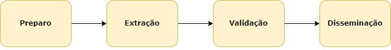
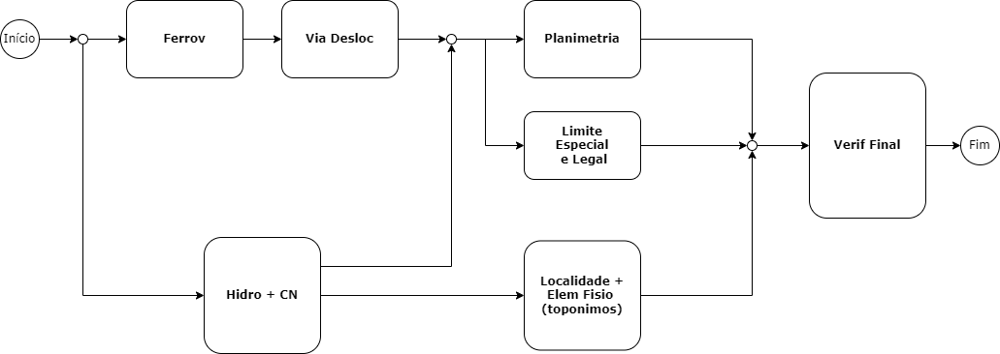

A linha de produção do CDGV Ortoimagem ET-EDGV 3.0 é composta das seguintes fases.

## Pré-definições

A definição da ortoimagem e MDT do projeto deve ser baseada na escala e nos parâmetros de qualidade do projeto, principalmente quanto a acurácia posicional.

Tal acurácia, relativa aos produtos finais (CDGV Ortoimagem e Carta Ortoimagem) será definida indiretamente, de acordo com a acurácia posicional dos insumos e garantindo que os erros inseridos durante o processo de produção não mudem o PEC do produto final. Nas informações marginais do produto deve estar claramente indicado a derivação, por exemplo *"PEC Planimétrico: A (derivado da ortoimagem")*.

## Preparo

O Preparo tem por finalidade preparar insumos básicos para execução da linha de produção. Ele é dividido em 3 subfases que podem ocorrer em paralelo:
* Preparo das imagens – definição da imagem do projeto, pansharpening, georreferenciamento, equalização, etc.
* Preparo da altimetria  – definição do MDT a ser utilizado, geração das curvas de nível.
* Coleta de insumo externo – coleta de informações relevantes, matricial, vetorial ou tabulares, para uso como insumo no processo de produção. Tal informação pode ser armazenada nas camadas auxiliares de insumo externo do banco de dados.

## Extração

A Extração consiste a fase principal e tem por finalidade construir o CDGV a partir da fotointerpretação e compilação de insumos. A figura abaixo representa as subfases da Extração, com maiores detalhamentos sendo encontrados [aqui](./extracao/extracao.md).

## Validação

A fase de Validação tem por finalidade realizar um controle de qualidade direto interno e a correção dos erros verificados, realizando de forma automática uma inspeção completa da consistência lógica de um conjunto de dados geoespaciais vetoriais. A fase de validação é dividida nas seguintes subfases:
* Validação nível produto – executada no enquadramento do produto; e
* Validação da ligação – executada no enquadramento do produto somado aos produtos vizinhos de forma a garantir a consistência da continuidade dos dados.

## Disseminação

A fase de Disseminação consiste na geração dos metadados, conversão e exportação para o formato *Shapefile* na modelagem EDGV 3.0, e carregamento no BDGEx.